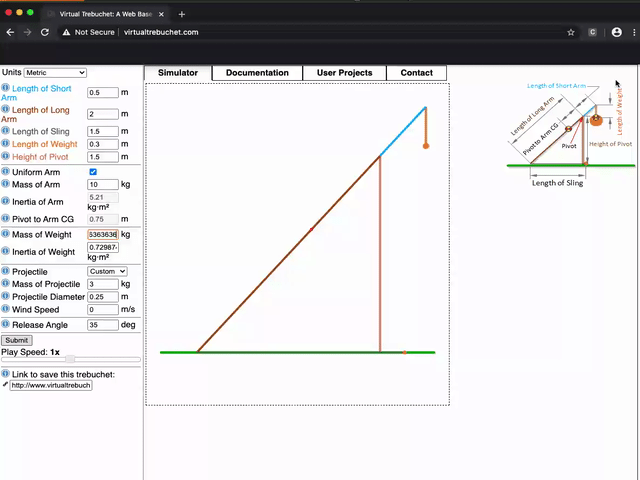

# Virtual Trebuchet Tester
`VirtualTrebuchet.py` allows for multiple tests to be conducted on a virtual trebuche, with the results being recorded 
to a CSV.



_Example data input_

## Set Up
1. [Install Selenium](https://www.selenium.dev/downloads/)
2. Install dependencies manually or with `poetry shell`

## [Example Code](./example.py)
This gives a general idea on how the code works. 

## Key Features

### Run Multiple Tests
Run a test by using `vt.save_data`. The test will combine all of the variables and output the range data to 
`multi_variable.csv`
```
vt.save_data(
    "multi_variable",
    length_long_arm=[4.4, 4.5, 4.6, 4.7, 4.8, 4.9, 5],
    projectile_mass=[3, 5, 7],
    arm_mass=[7, 10, 13])
```

### Run a Single Test
```
vt.save_data("single_variable", length_long_arm=[4.4, 4.5, 4.6, 4.7, 4.8, 4.9, 5])
```
